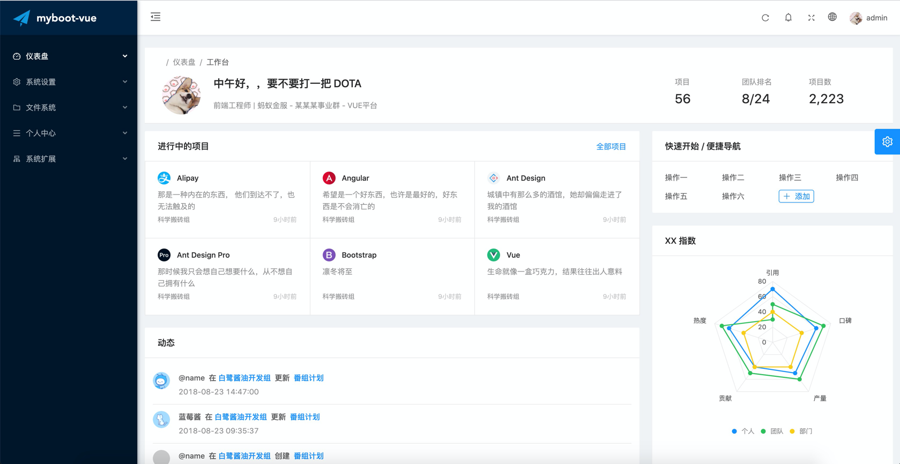
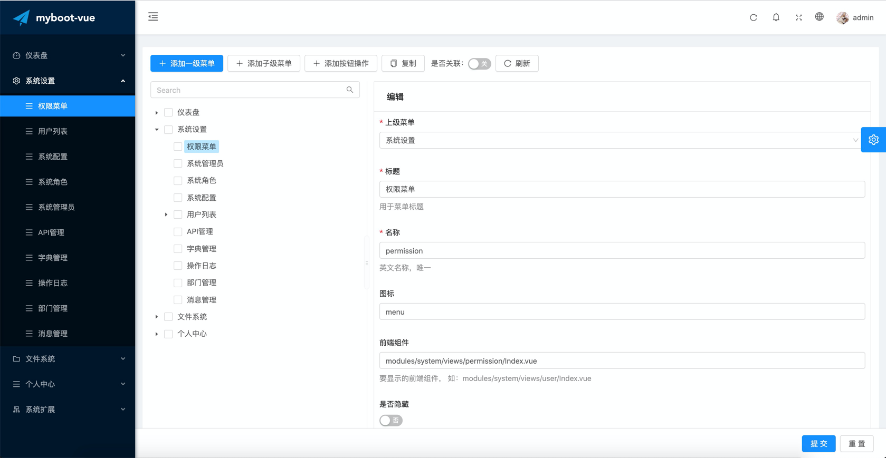
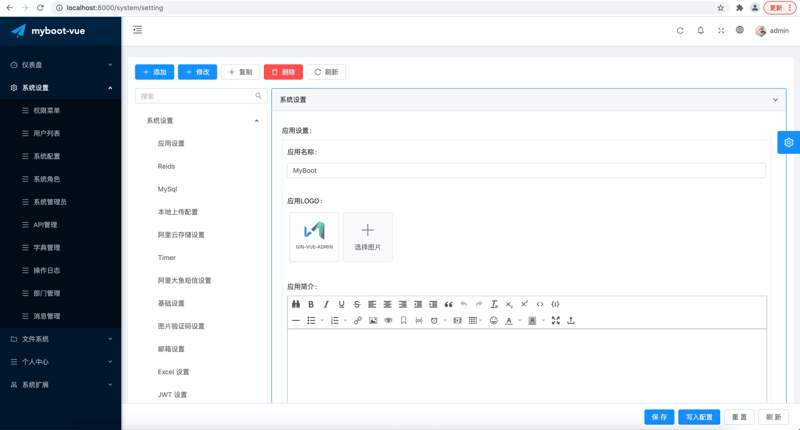
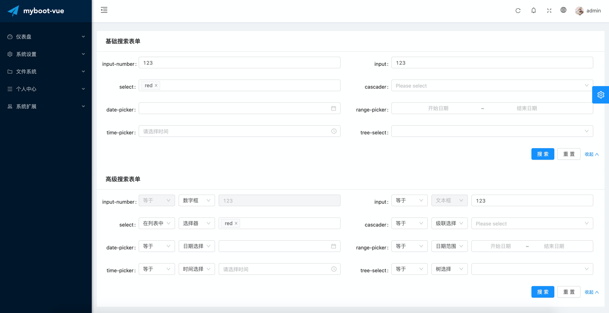
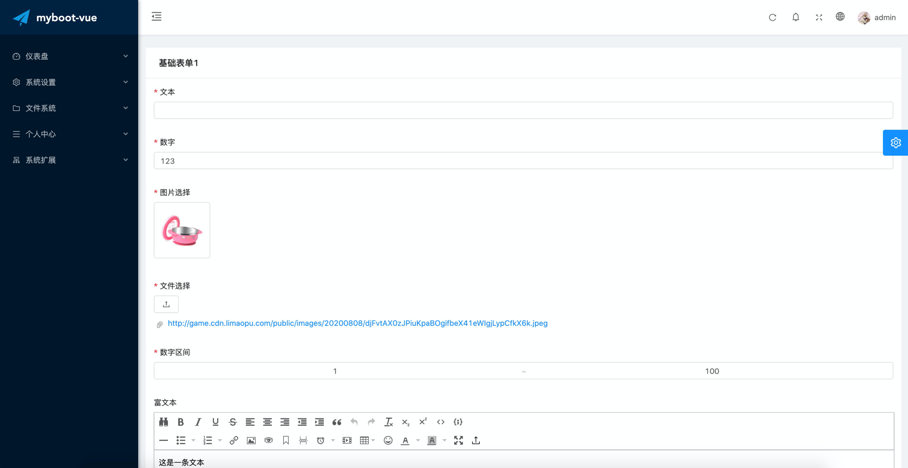

<p align="center">
  <a href="http://docs.limaopu.com/">
    
  </a>
</p>

<p align="center">
  <a href="#简介">简介</a>&nbsp;|&nbsp;<a href="#快速开始">快速开始</a>&nbsp;|&nbsp;<a href="#版本日志">版本日志</a>
</p>


## 简介

myboot-vue 基于 Vue+Antd 构建的敏捷脚手架。

myboot 是一套前后端完整的解决方案，后端部署请移步：

- [laravel-myboot](https://github.com/westhack/laravel-myboot) php版本
- [gin-myboot](https://github.com/westhack/gin-myboot) go 版本
- [spring-myboot](https://github.com/westhack/spring-myboot) java 版本

### 文档地址

[http://docs.limaopu.com/](http://docs.limaopu.com/)

### 线上 Demo

[http://laravel-vue.limaopu.com/](http://laravel-vue.limaopu.com/)

### 界面预览

<br>
<br>

<br>
<br>

<br>
<br>

<br>
<br>


## 快速开始

```sh
# clone myboot-vue
$ git clone https://github.com/westhack/myboot-vue.git

# install dependency
$ cd myboot-vue
$ yarn install

# develop
$ yarn serve
```

## 讨论交流
微信公众号搜索：计算机程序设计艺术
<br>


有问题扫码加微信咨询


喜欢就star❤️一下吧

## 版本日志

### 0.0.1

1.  初始化项目
